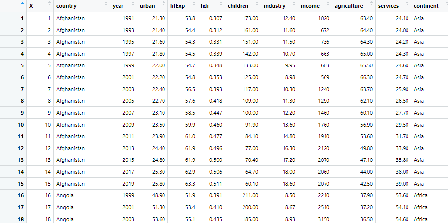
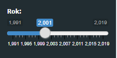

```{r setup, include=FALSE}
knitr::opts_chunk$set(echo = FALSE)
```


## Spis treści

### Spis treści

 DANE
 
  + Źródło danych
  + Zakres lat
  + O danych
  + Używane dane
  
  GLOBAL.R
  
  + Biblioteki
  + Wczytanie danych do projektu
  + Zmienne
  + sliderInput
 
###
 
  UI.R
  
  + dashboardHeader
  + dashboardSidebar
  + ConditionalPanel
  + dashboardBody
  
 SERVER.R

  + Funkcja
  + Dodanie nagłówków
  + Wczytanie 5 najmniejszych i największych wartości
  + Wykres słupkowy
  + Struktura danych
  + Statystyki 
  + Histogram i wykres pudełkowy z wąsem
  + Wykres punktowy
  + Macierz korelacji
 
 

## DANE

### Źródło danych

Dane pochodzą ze strony gapminder.org. Zestaw został utworzony samodzielnie w pliku csv.
Znajdują się w nim wybrane przez nas wskaźniki w różnych krajach na całym świecie.

https://www.gapminder.org/

```{r echo=FALSE, out.width = "30%", fig.align = "center"}
knitr::include_graphics("gapminder.png")
```


###

**Zakres lat**

Pobrane dane zebrane są od roku 1991 do 2019 dla lepszego zobrazowania analizowanych wskaźników.

**O danych**

Dane dotyczą:

* ubranizacji
* uprzemysłowienia
* usług
* rolnictwa
* oczekiwanej długości życia
* współczynnika HDI
* wskaźnik mówiący o liczbie śmierci dzieci na 1000 urodzeń
* dochodu

### Używane dane:


```{r echo=FALSE, out.width = "90%", fig.align = "center"}

```

## GLOBAL.R


### 

Plik global.r wykorzystujemy głównie, aby
wczytać wymagane do projektu biblioteki, wczytać
nasze dane. Ustawiamy tam także nowe zmienne, które będziemy wykorzystywać w dalszej części projektu.


Wymagane biblioteki:

\
\

```{r, eval = FALSE, echo=TRUE}


library(shiny) # pozwala na tworzenie interaktywnych aplikacji, pulpitow nawigacyjnych
library(shinydashboard) # dzieki niej mozna zrobic ciekawe dashboardy
library(DT)  # dane moga byc wczytywane jako tabela dzieki tej bibliotece
library(dplyr)  # pozwala na efektywniejsza prace z danymi
library(plotly) # biblioteka do tworzenia wykresow
library(ggplot2) # wykorzystywana do robienia wykresow
library(ggtext) # pozwala na ulepszenie tekstu w ggplocie
library(ggcorrplot) # sluzy do pokazania korelacji miedzy danymi
library(shinycssloaders) # dodawanie animacji


```


### 

Następnie wczytujemy dane w postaci pliku CSV. Pobieramy te dane z naszego repozytorium na github.com.


```{r}
my_data<- read.csv("https://raw.githubusercontent.com/patipila/Dane/main/danecale.csv",sep=",")

```

Do zmiennej country przypisujemy nazwy państw z naszego zestawu
```{r, eval=F,echo=T}
country = rownames(my_data$country)
```

Dodajemy cztery nowe zmienne (c1, c2, c3, c4), by usprawnić dalszą pracę nad analizą danych. Zmienne te pobierają tylko wybrane kolumny ze zbioru danych. Zmienna c4 to wektor zawierający nazwy kontynentów

```{r,eval=F,echo=T}
c1 = my_data %>% 
  select(-c("country","year","X")) %>% 
  names()

c2 = my_data %>% 
  select(-"country", -"income",-"year",-"X") %>% 
  names()

c3= my_data %>% 
  select(-"country",-"year",-"X",-"continent") %>% 
  names()

c4=c("Asia","Europe","Americas","Africa","Oceania")

```

## UI.R

### 

W pliku ui.R programujemy cały design dla naszego dashboardu, czyli dashboardPage.

Zaczynamy od dashboardHeader, w którym ustawimy nazwę

     dashboardPage(
        dashboardHeader(title="Dane dotyczace gospodarki w R & Shiny Dashboard", titleWidth = 650),


\

Przejdźmy do dashboardSidebar, w którym ustawiamy najpierw sidebarMenu, dzięki któremu, po lewej stronie możemy wybrać czy chcemy przeglądać informacje o danych, czy przechodzimy do wizualizacji.
  
    dashboardSidebar(sidebarMenu(id = "sidebar",
          menuItem("Dane", tabName = "data", icon = icon("database")),
          menuItem("Wizualizacja", tabName = "viz", icon=icon("chart-line")),


###

Przechodzimy do sliderInput. Dzięki temu sliderowi mamy możliwość wyboru interesującej nas daty od 1991 roku do 2019 (dane co dwa lata).

      sliderInput("slider", "Rok:", 1991, 2019, step=2,value=1991),


/

Wstawiamy panel warunkowy do warunkowego wyglądu widżetu. Filtr powinien pojawiać się tylko dla menu wizualizacji i wybranych w nim zakładek

    conditionalPanel("input.sidebar == 'viz' && input.t2 == 'distro'", selectInput(inputId = "var1" , 
     label ="Wybierz wskażnik" , choices = c1)),
        conditionalPanel("input.sidebar == 'viz' && input.t2 == 'trends' ", selectInput(inputId = "var2" , 
      label ="Wybierz wskażnik"  ,choices = c2)),
      conditionalPanel("input.sidebar == 'viz' && input.t2 == 'relation' ", selectInput(inputId = "var3" , 
      label ="Wybierz wskażnik X " , choices = c1, selected = "lifeExp")),
      conditionalPanel("input.sidebar == 'viz' && input.t2 == 'relation' ", selectInput(inputId = "var4" , 
      label ="Wybierz wskażnik Y " , choices = c1, selected = "children")),
      conditionalPanel("input.sidebar == 'viz' && input.t2 == 'trends' ", selectInput(inputId = "var5" , 
      label ="Wybierz kontynent " , choices = c4, selected = "Europe")),
      conditionalPanel("input.sidebar == 'viz' && input.t2 == 'distro' ", selectInput(inputId = "var6" , 
      label ="Wybierz ilosc slupkow " , choices = c(2:20), selected = "5"))))
      


###
Dzięki temu możemy wybierać w wizualizacjach interesujące nas wskaźniki, kontynent lub ilość słupków.

\

   


###
W dashboardBody kreaujemy elementy naszej pierwszej zakładki: Dane. Te elementy to dane (pokazanie danych), struktura oraz statystyki (min, max, mediana, średnia, kwartle)

      dashboardBody(
         tabItems(
            ##Element pierwszej zakładki
                tabItem(tabName = "data", 
                    tabBox(id="t1", width = 12, 
                     
                     tabPanel("Dane", dataTableOutput("dataT"), icon = icon("table")), 
                     tabPanel("Struktura", verbatimTextOutput("structure"), icon=icon("uncharted")),
                     tabPanel("Statystyki", verbatimTextOutput("summary"), icon=icon("chart-pie"))
              )
            )
            
  

    

###
To samo robimy z elementami drugiej zakładki: Wizualizacja. W niej możemy znaleźć Wskaźniki w państwach (wykres słupkowy), Listę 5 państw, w których dany współczynnik jest najmniejszy oraz największy, Rozkład (histogram i wykres pudełkowy), Macierz korelacji oraz Związek między dwoma wskaznikami (wraz z wyborem metody wygładzenia).

    tabItem(tabName = "viz", 
    tabBox(id="t2",  width=12, 
    tabPanel("Wskazniki w panstwach", value="trends",
    fluidRow(tags$div(align="center", box(tableOutput("top5"),
    title = textOutput("head1") , collapsible = TRUE, status = "primary",  c
    ollapsed = TRUE, solidHeader = TRUE)),
    tags$div(align="center", box(tableOutput("low5"), 
    title = textOutput("head2") , collapsible = TRUE, status = "primary",  
    collapsed = TRUE, 
    solidHeader = TRUE))),
    withSpinner(plotlyOutput("bar"))),
    tabPanel("Rozklad", value="distro",
    withSpinner(plotlyOutput("histplot", height = "350px"))),
    tabPanel("Macierz korelacji", id="corr" , 
    withSpinner(plotlyOutput("cor"))),
    tabPanel("Zwiazek miedzy dwoma wskaznikami", 
    radioButtons(inputId ="fit" , 
    label = "Wybierz metode wygladzenia" , choices = c("loess", "lm"),
    selected = "lm" , inline = TRUE), 
    withSpinner(plotlyOutput("scatter")), value="relation"),
            side = "left" ),
                        )
                      )
           
          
###


```{r echo=FALSE, out.width = "90%", fig.align = "center"}

```


## SERVER.R

###
W pliku server.r robimy tabelę z danymi, dodajemy nagłówki, wczytujemy wartości, dodajemy wykresy.Tworzymy z tego FUNKCJĘ.

    function(input, output, session)

Dodajemy tabelę z danymi, w której można pokazać pewną ilość wierszy, wyszukać interesujące dane i przeglądać wszystkie strony z danymi.

      output$dataT <- renderDataTable(my_data)
  

```{r echo=FALSE, out.width = "90%", fig.align = "center"}

```


###

Dodajemy nagłówki tabel dużych oraz małych oraz wczytujemy 5 najmniejszych/największych wartości

    output$head1 <- renderText(
      paste("5 panstw z najwiekszym wskaznikiem", input$var2) )
  
    output$head2 <- renderText(
      paste("5 panstw z najmniejszym wskaznikiem", input$var2))
  
    output$top5 <- renderTable({
    
    my_data %>% 
      filter(year==input$slider)%>%
      select(country, input$var2) %>% 
      arrange(desc(get(input$var2))) %>% 
      head(5)
    })
    
     output$low5 <- renderTable({
    
    my_data %>% 
      filter(year==input$slider)%>%
      select(country, input$var2) %>% 
      arrange(get(input$var2)) %>% 
      head(5)
    })
    
    
###

Po wybraniu wskaźnika, roku oraz kontynentu wyświetlony zostaje wykres słupkowy, który przedstawia dane z państw z wybranego kontynentu. Na górze możemy rozwinąć listę i zobaczyć TOP 5 PAŃSTW, które mają najniższe i najwyższe wartości danego wskaźnika. Dzięki temu możemy porównywać ze sobą państwa, zobaczyć czy są duże różnice między wartościami i porównać to z całym światem.


```{r echo=FALSE, out.width = "100%", fig.align = "center"}

```


###

Prezentujemy tutaj strukturę danych (str) oraz wybrane statystyki podstawowe (summary).

     output$structure <- renderPrint({
      my_data %>% 
        str()
            })
            
    output$summary <- renderPrint({
      my_data %>% 
        filter(year==input$slider)%>%
          select(-"country",-"year",-"X",-"continent")%>%
                                                      summary()})
###
 


###
Tutaj pokazujemy histogram (w którym mamy możliwość wyboru liczby słupków) oraz wykres pudełkowy z wąsem. Te dwa wykresy łączymy ze sobą.

      output$histplot <- renderPlotly({
    
    p3= my_data %>%
      filter(year==input$slider)%>%
      ggplot() + 
      geom_histogram(mapping = aes(x = get(input$var1)),
                     bins = input$var6,
                     fill = "lightblue",
                     color = "black") +
      labs(x= paste(input$var1))
    
    
    p1= ggplotly(p3)
    
    p2 = my_data %>%
      filter(year==input$slider)%>%
      plot_ly() %>%
      add_boxplot(x=~get(input$var1)) %>% 
      layout(yaxis = list(showticklabels = F))

    subplot(p2, p1, nrows = 2, shareX = TRUE) %>%
      hide_legend() %>% 
      layout(title = "Histogram i wykres pudełkowy")})
        
###
  
```{r echo=FALSE, out.width = "100%", fig.align = "center"}

```
  
 ###
 
 Dodajemy wykres punktowy, który pokaże nam relację między dwoma wybranymi wskaźnikami (X i Y). Możemy wybrać metodę wygładzania. Dodatkowo wykres posiada interaktywne pola.
  
    output$scatter <- renderPlotly({
    p = my_data %>% 
      filter(year==input$slider)%>%
      ggplot(aes(x=get(input$var3), y=get(input$var4))) +
      geom_point() +
      geom_smooth(method=get(input$fit)) +
      labs(title = paste("Relacja miedzy", input$var3 , "a" , input$var4),
           x = input$var3,
           y = input$var4) +
      theme(  plot.title = element_textbox_simple(size=10,
                                                  halign=0.5))
      
    ggplotly(p)})
    
```{r echo=FALSE, out.width = "100%", fig.align = "center"}

```


###

Dodajemy jeszcze wykres korelacji oraz obliczamy macierz korelacji. Dzięki temu możemy zobaczyć, jaki jest związek między dwoma wskaźnikami.
  
          output$cor <- renderPlotly({
          my_df <- my_data %>% 
      select(-"country",-"continent",-"X",-"year")
    
    corr <- round(cor(my_df), 1)
  
    p.mat <- cor_pmat(my_df)
    
    corr.plot <- ggcorrplot(
      corr, 
      hc.order = TRUE, 
      lab= TRUE,
      outline.col = "white",
      p.mat = p.mat )
    
    ggplotly(corr.plot)})
  
  
###
Korelacja może przyjąć wartości od -1 do +1. Odchylenie skrajnie ujemne oznacza, że im wyższa jest wartość jednej zmiennej, tym niższa dla drugiej, z kolei skrajnie dodatni wynik oznacza, że obie wartości będą rosły lub malały synchronicznie. 0 wskazuje na całkowity brak związku pomiędzy zmiennymi.

```{r echo=FALSE, out.width = "80%", fig.align = "center"}

```
 